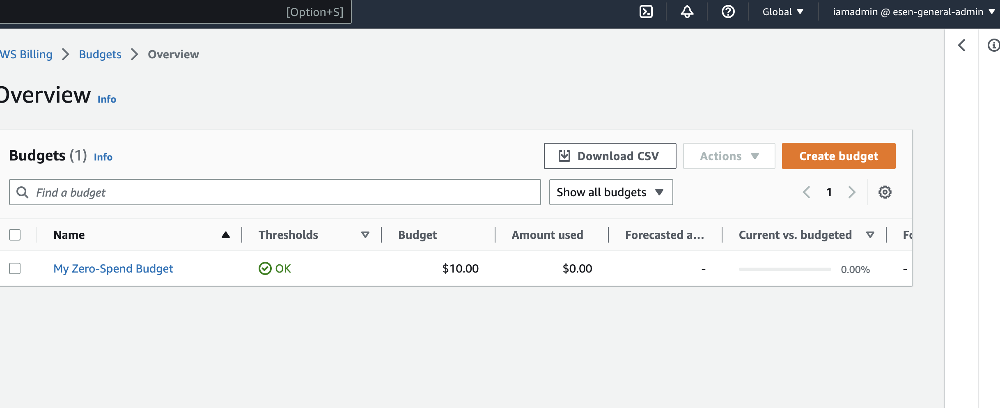

# Week 0 — Billing and Architecture

## AWS CLI installation and verification was done by committing through gitpod.

## Creating budget
I have created a budget for $10. And I have set alarm for 50%, 75% and 100%.
It will be emailing me if any of the threshold is exceeded.
My AWS account alias is esen-general-admin
You can see it in the following image.

## Creating Logical model on LucidChart
I enjoyed creating the chart. I could not find third party serverless icon on LucidCharts.
I took a screenshot of Momento icon from google and drag/drop into LucidCharts.
It was quiet impressive to experience how flexible LucidCharts is.
Here is my final flowchart.

[Logical model of Cruddur](https://lucid.app/lucidchart/cc75068e-4823-449a-a9f4-f91ab9da75e5/edit?viewport_loc=35%2C-92%2C2487%2C1301%2C0_0&invitationId=inv_e55e919e-4758-44df-b2e0-376790691283)
