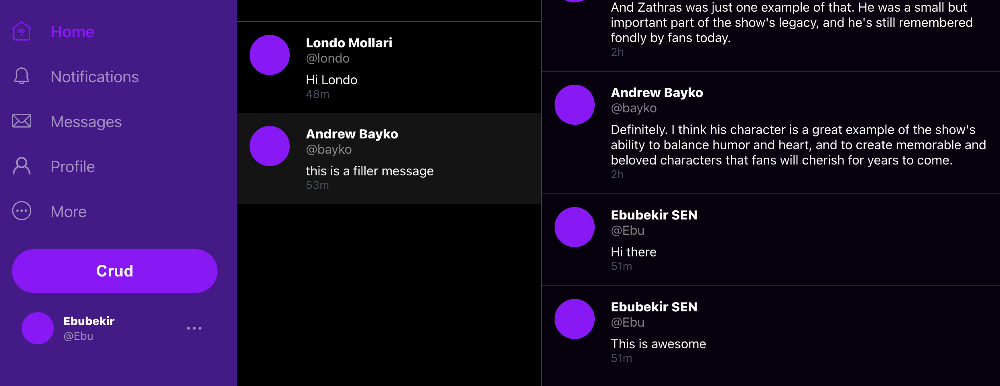
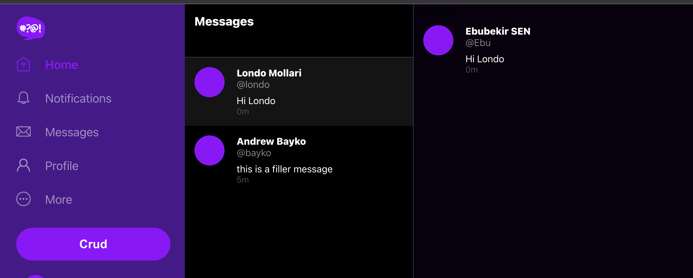

# Week 5 — DynamoDB and Serverless Caching
DynamoDB table creation
We created a single table to store instant messaging in DynamoDB.
DynamoDB is a NOSQL database. It is extremely fast and scalable.
Therefore we decided to use DynamoDB in direct messaging in Cruddur app.
In DynamoDB, instead of indexes compared to SQL databases, there are partition key and sort key.
Partition key and sort key are used to query the data.
We have used message group ids as partition key and user ids as sort key.
When we query with partition key, it will be returning a message group and messages that belong to this message group.
The most difficult part of creating single table design was deciding primary keys according to the access patterns we have.
We outlined the access patterns and layout the table structure before creating the table.

[Access patterns](assets/DynamoDb single table access patterns.png)

After creating DynamoDB database. We worked only in the local. We set AWS_END_POINT in Docker Compose file to be http://dynamodb-local:8000
Then by using the RDS local database we gave created in week 4, we loaded schema and seeded our data. 
In our seed data we did not have Cognito user ids. We created a Pythin script by using BOTO3 library. In order to get conversations between two users, I created another Cognito User for Bayko. Then we can connected to our Cognito identity pool, obtained Cognitio user ids and updated our RDS local database with Cognito user ids. Code for the bash scripts and python scripts can be found in the following 
After updating Cognito user ids, we loaded our schema to local DynamoDB and seed data into the table.
After uploading data, we were able to get conversations and list conversation between the two Cognito Users we had. 

Implementing conversations also required multiple changes on the frontend pages. We also added new message page, updated their routes.
I was stuck at this week for almost two weeks. Finally, here is the final screenshots of my accomplishment.

