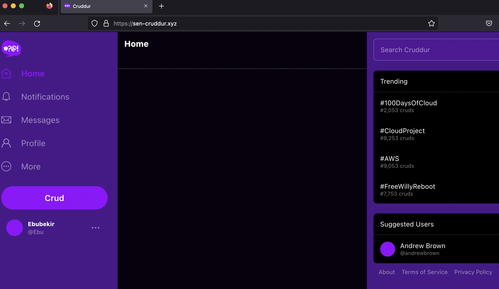

# Week 6 — Deploying Containers

In this week, we started with replacing our db/connect script with db/test script. Db/connect was in bash script and it was using psql command to make the connection. However, when we want to connect to RDS we do not have psql client there, therefore we replaced it with a python script.
```python
#!/usr/bin/env python3

import psycopg
import os
import sys

connection_url = os.getenv("CONNECTION_URL")

conn = None
try:
  print('attempting connection')
  conn = psycopg.connect(connection_url)
  print("Connection successful!")
except psycopg.Error as e:
  print("Unable to connect to the database:", e)
finally:
  conn.close()
```
Then in our app.py, we inserted a health check function which turns in a success message if the flask app is working. This health check will also tell about the health of backend-flask container.

## Creating Repos in ECR.  
We created repos with mutable tags. With this way, we do not have to worry about updating tags at each time.

```
aws ecr create-repository \
  --repository-name cruddur-python \
  --image-tag-mutability MUTABLE
  
  aws ecr create-repository \
  --repository-name frontend-react-js \
  --image-tag-mutability MUTABLE
```
Then we need to login to ECR. We created a bash script to login ECR. We used existing env variables we have in Gitpod to make a generic command for everyone. 
```
aws ecr get-login-password --region $AWS_DEFAULT_REGION | docker login --username AWS --password-stdin "$AWS_ACCOUNT_ID.dkr.ecr.$AWS_DEFAULT_REGION.amazonaws.com"
```
We exported image url.
```

export ECR_PYTHON_URL="$AWS_ACCOUNT_ID.dkr.ecr.$AWS_DEFAULT_REGION.amazonaws.com/cruddur-python"
echo $ECR_PYTHON_URL

export ECR_FRONTEND_REACT_URL="$AWS_ACCOUNT_ID.dkr.ecr.$AWS_DEFAULT_REGION.amazonaws.com/frontend-react-js"
echo $ECR_FRONTEND_REACT_URL
```
Then we build the base python container. We tagged it and pushed it with the below code.

```
docker pull python:3.10-slim-buster
docker tag python:3.10-slim-buster $ECR_PYTHON_URL:3.10-slim-buster
docker push $ECR_PYTHON_URL:3.10-slim-buster
```
Up to this week, we were pulling base python image from DockerHub. According to Andrew Brown, too many request during production might trigger Docker to reduce this traffic. Therefore we changed where the python base image is pulled in the Docker file to Elastic Container Registry (ECR).

Next step was to create backend and frontend repos. We followed the same steps; created a repo and set the url for backend and frontend. After connecting to this repos. We build containers, tag them and push them to ECR. After pushing to ECR we changed on dashboard on AWS to Elastic Container Service (ECS).

### Creating Services and Tasks
In ECS, there are two major options. The first one is service, which serves continously. The second one is task. Task is a one time thing, when it is completed it kills itself. Since we will be running a web application and would like to serve it continously, we started creating a service for backend and frontend. 

#### Roles and Permissions
We created two policies; one for service execution role and one for assuming this service execution role as task role.
Then created task role and attached the policies on this roles. 

#### Creating environment variables in parameter store
Since we were using environment variables in Gitpod, we need to move them to AWS. We created these variables in parameter store by using a similar code as the following sample.
```
aws ssm put-parameter --type "SecureString" --name "/cruddur/backend-flask/AWS_ACCESS_KEY_ID" --value $AWS_ACCESS_KEY_ID
```
#### Task Definitions
In aws directory create task-definitions folder and create backend-flask.json file. Task definition is similar to docker file and it includes info how we would like to start our app. Then we registered our task definition in ECS. THis step was required to create the service.

Next step was to create the security groups. We used the following CLI commands to obtain default VPC and subnet.
Obtaining default VPC and Subnet ids:
```
export DEFAULT_VPC_ID=$(aws ec2 describe-vpcs \
--filters "Name=isDefault, Values=true" \
--query "Vpcs[0].VpcId" \
--output text)
echo $DEFAULT_VPC_ID

export DEFAULT_SUBNET_IDS=$(aws ec2 describe-subnets  \
 --filters Name=vpc-id,Values=$DEFAULT_VPC_ID \
 --query 'Subnets[*].SubnetId' \
 --output json | jq -r 'join(",")')
echo $DEFAULT_SUBNET_IDS
```
THen we created security group in default VPC:
```
export CRUD_SERVICE_SG=$(aws ec2 create-security-group \
  --group-name "crud-srv-sg" \
  --description "Security group for Cruddur services on ECS" \
  --vpc-id $DEFAULT_VPC_ID \
  --query "GroupId" --output text)
echo $CRUD_SERVICE_SG
```
Next steps were to edit the inbound rules to give access to backend, frontend and the database.
```
aws ec2 authorize-security-group-ingress \
  --group-id $CRUD_SERVICE_SG \
  --protocol tcp \
  --port 4567 \
  --cidr 0.0.0.0/0

aws ec2 authorize-security-group-ingress \
  --group-id $CRUD_SERVICE_SG \
  --protocol tcp \
  --port 3000 \
  --cidr 0.0.0.0/0

aws ec2 authorize-security-group-ingress \
  --group-id $DB_SG_ID \
  --protocol tcp \
  --port 5432 \
  --source-group $CRUD_SERVICE_SG
```
We edited RDS security group since it was running on default security group and gave a access to Crud_Service_sg.
We were able to connect to RDS by using db/test script.

#### Enabling Service Connect
Service connect is similar to app mesh and cloud map. It displays the network of services we create. We force delete the backend flask service and changed task definition to include service connect. Then we tagged and pushed the service again. Here is the [commit](https://github.com/ebusen/aws-bootcamp-cruddur-2023/commit/3f75b48183aafeb0224bedd5acecad91d97b787b) for this successful backend-flask service.

## Application load balancer.
We created applciation load balancer with a new security group; cruddur-alb-sg with in nbound rules for  http/https anywhere.  
In cruddur service security group, on port 4567 we gave access to application load balancer security group. We deleted the old one. This will enable access only through ALB. 
We created two target groups for the load balancer. One for backend one for frontend. Then we added listeners to 3000 and 4567 ports pointed at these target groups. We updated our task definition to include load balancer info. We deleted the old service and created a new one which uses load balancer.
We checked if load balancer was working fine by copying the DNS name of load balancer and pasting into the browser
DNS:4567/api/health-check worked. If we try ip of backend-flask task:4567/api/health-check it did not work anymore since we did not allow direct access in the security group. Load balancer working [code](https://github.com/ebusen/aws-bootcamp-cruddur-2023/commit/964dd65025df65606e6433184d611d3f8ee37c8f)


## Creating Frontend Service
We used Node, because we need to compile static assets. Node allows developers to write JavaScript code that runs directly in a computer process itself instead of in a browser. Node can be used to write server-side applications with access to the operating system, file system, and everything else required to build fully- functional applications. Node.js is a backend JavaScript runtime environment, runs on V8 JavaScript engine, and executes JavaScript code outside a web browser. In order to build the static assets, we used nginx.
We created frontend static assets in build folder. We added this file to git-ignore since we did not want these files committed. Next step is to run these static assest by using ngix. Next step was to build frontend. We registered task definition. Then created frontend service. In Alpine, we have curl command We can use this to do the health check. Updated frontend task definition and registered again. Security group crud-serv-sg add custom tcp 3000 choose alb sg change description to ALBbackend and ALB frontend. Then copy ALB DNS and :3000 we should be able to see the cruddur website with notifications on it. Frontend working behind ALB [code](https://github.com/ebusen/aws-bootcamp-cruddur-2023/commit/b4ba315560c42e3cd3596385870e6b8f5fae6e7c).

## Registering domain and creating hosted zone
I registered my domain from [porkbun](https://porkbun.com/) My domain adress is sen-cruddur.xyz
In Route53, I created a hosted zone and copied AWS name servers to replace porkbun name servers. This way I was able to serve external domain with AWS services. In order to enable secure connection I requested certificates through AWS certificate manager for sen-cruddur.xyz and *.sen-cruddur.xyz domains.
Then select the certificate and create two records. In EC2 Load balancer, select listener and then manage rules dropdown. We would like to add some rules for paths to the subdomains. Redirect http protocol to https on port 443. Forward https to frontend target group and enables with SSL certificate.
Deleted listeners on port 3000 and 4567. Select port 443 listener, manage rules if host header has api.sen-cruddur.xyz then it forwards the request to backend target group. In Route 53 create a rule to point ALB as endpoint.

We have changed the backend and frontend urls and registered task definitions again. Build, tag and push our containers one more time to ECS.
Checked the health of target groups of load balancer and checked the health of both services. 


There are no notifications on my website cause my RDS instance was not working at the time. The code cane be found [here](https://github.com/ebusen/aws-bootcamp-cruddur-2023/commit/239e5d2396590a9bed59f6c8071009ac258dafb5) for backend and frontend working in the new domain.

## CONTAINER DEPLOYING MODES
One of the main advantages of using containers is that you can pack multiple containers onto a single host. When doing this, you need to choose how you want to network the containers that are running on the same host. There are three deploying modes for containers; host, bridge and awsvpc. Host provides a physical port on host for each container. Bridge mode enables multiple containers on the sam einternal port, then load balancers configure external ports.  With the awsvpc network mode, Amazon ECS creates and manages an Elastic Network Interface (ENI) for each task and each task receives its own private IP address within the VPC. Since Fargate is used only with awsvpc, we continued with awsvpc. More info on network modes can be found [here](https://docs.aws.amazon.com/AmazonECS/latest/bestpracticesguide/networking-networkmode.html)

## Securing FLASK and fix messaging in production
We created a new Docker file for production. We disabled debug more in this Dockerfile so that erros are not revealed to users. Then we needed to pass the env variables to Docker file. We created a docker folder, create build folder and inside the build folder create backend-flask-prod and frontend-react-js-prod. Created another folder named run, created  backend-flask-prod and frontend-react-js files in this folder. These scripts can be found in this [commit](https://github.com/ebusen/aws-bootcamp-cruddur-2023/commit/0a7dab781502aa576c97350c012f52f39afcae4f). By using these scripts we automated build, push, run and deploy both containers. We decided to reorganize the scripts and moved bin driectory up one level under the workspace. I kept the health-check file under the backend-flask since it was referred before. Then we decided to create environment variables each time worskpace is started. We created generate-env scripts and env files for both backend and frontend. Generate-env file are using Ruby and ERB templating system. Rearranged and generating env variable scripts can be found [here](https://github.com/ebusen/aws-bootcamp-cruddur-2023/commit/78f0379be01501754698a6bb154d36986fccdeff)
Before the commit, we made sure that we added env variables in git-ignore file.

## Implement refresh token cognito
Since token was expiring while we were working on the website multiple times, Andrew decided to solve the problem. We made changes on the checkAuth.js. 

```js
import { Auth } from 'aws-amplify';
import { resolvePath } from 'react-router-dom';

export async function getAccessToken(){
  Auth.currentSession()
  .then((cognito_user_session) => {
    const access_token = cognito_user_session.accessToken.jwtToken
    localStorage.setItem("access_token", access_token)
  })
  .catch((err) => console.log(err));
}

export async function checkAuth(setUser){
  Auth.currentAuthenticatedUser({
    // Optional, By default is false. 
    // If set to true, this call will send a 
    // request to Cognito to get the latest user data
    bypassCache: false 
  })
  .then((cognito_user) => {
    console.log('cognito_user',cognito_user);
    setUser({
      display_name: cognito_user.attributes.name,
      handle: cognito_user.attributes.preferred_username
    })
    return Auth.currentSession()
  }).then((cognito_user_session) => {
      console.log('cognito_user_session',cognito_user_session);
      localStorage.setItem("access_token", cognito_user_session.accessToken.jwtToken)
  })
  .catch((err) => console.log(err));
};
```
Then by using find in file, we searched for Authorization and fixed the pages where it was referring to checkAuth. 
I have both target groups and services working again in healthy condition. Here are some screeshots of my achievement.


